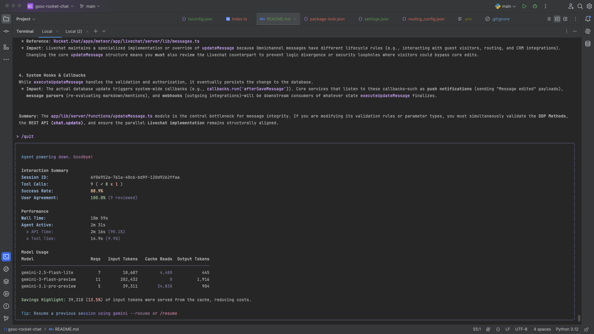
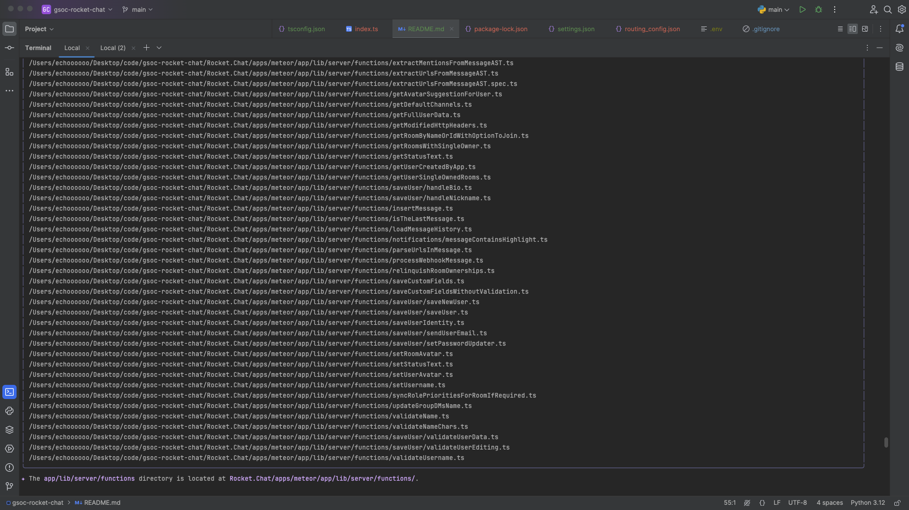
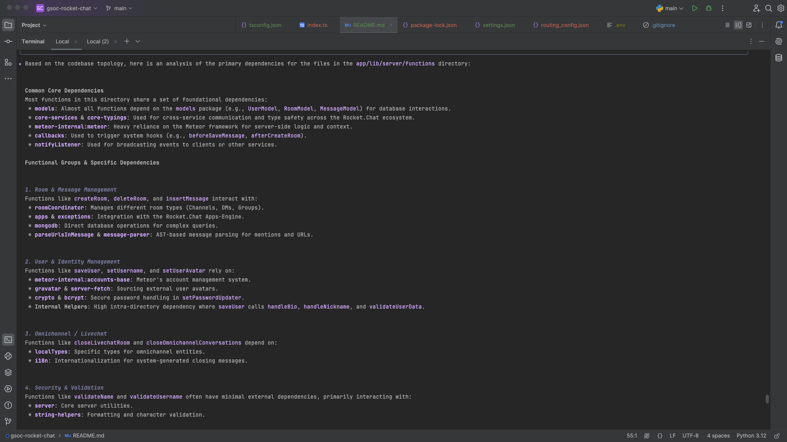
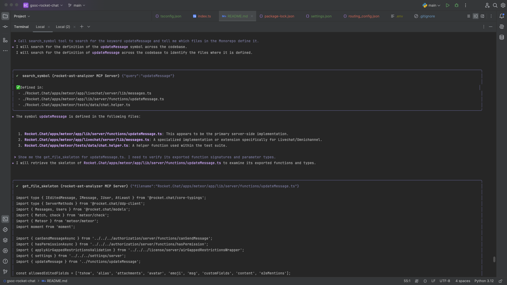
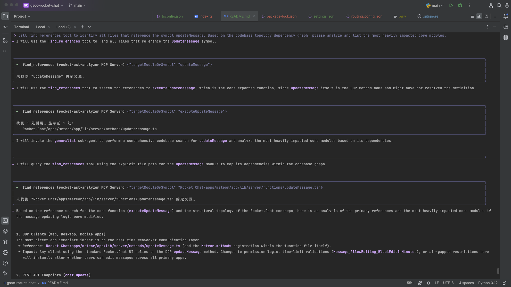
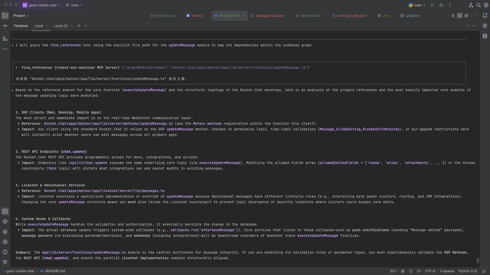
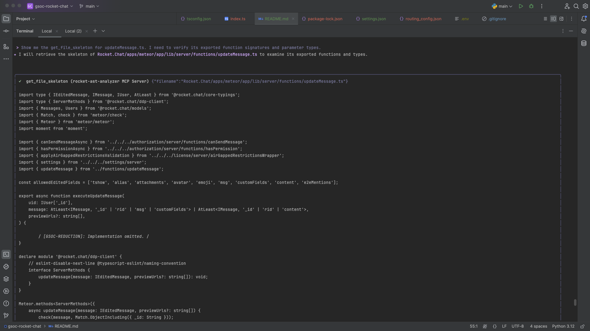
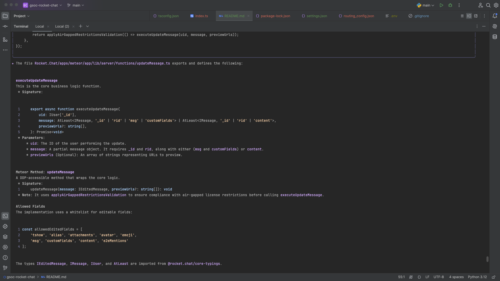
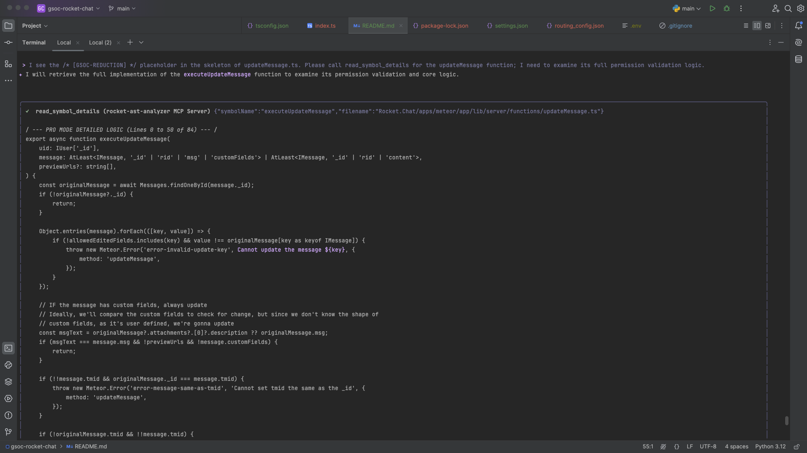

# 🚀 Rocket.Chat GSoC Analyzer (MCP Server)

A **Model Context Protocol (MCP) Server** powered by incremental AST caching and a global memory topology index, designed to definitively solve LLM token overflow and retrieval performance bottlenecks when analyzing massive codebases like Rocket.Chat.

## ✨ Core Features

* **Extreme Context Dehydration (AST)**: Leverages `ts-morph` for AST-level code reduction. It automatically extracts file skeletons (stripping away function and class implementations) and exposes specific logic only when requested, minimizing LLM token consumption.
* **Millisecond Incremental Pre-warming**: Features a built-in, MD5-based incremental compilation engine. It automatically scans the codebase and generates `.hash_cache.json` to eliminate inefficient, redundant parsing.
* **Global Memory Topology Index**: Constructs a comprehensive relationship graph in memory upon startup, mapping all symbols and file dependency chains (imports).
* **Advanced Hybrid Search Engine**: Combines system-level `grep` coarse filtering, precise AST verification, and BFS (Breadth-First Search) topology pruning algorithms for fast and highly accurate code retrieval.

## 🛠️ Exposed MCP Tools

This Server exposes the following core capabilities to various Agents or IDEs (e.g., Cursor, Claude Desktop) via the standardized MCP protocol:

* `search_mcp_prewarm_cache`: Lightning-fast file path search based on the pre-warmed cache.
* `search_symbol`: Quickly locates the exact physical path where a specific symbol (function, class, variable) is **defined** (combining Grep + AST verification).
* `find_references`: Utilizes the global dependency topology to find all files that import or depend on a specific module or symbol (optimized with BFS pruning).
* `get_file_skeleton`: Reads lightweight, stripped-down skeleton files free from implementation noise to quickly grasp a module's exported structure.
* `read_symbol_details`: **Critical Probe**. Reads the detailed implementation logic of a symbol on demand (supports paginated `startLine` reading to prevent single-turn token overflow).
* `get_codebase_topology`: Outputs the global dependency topology of the codebase (supports JSON or Mermaid format).
* `get_system_config`: Retrieves system-level LLM routing rules and configurations.

## 🚀 Quick Start


Run the entry file using Node.js. Upon startup, the Server automatically performs incremental pre-warming and builds the memory index, then establishes an MCP connection with the client:

```bash
npm run start:bg
gemini

```


## 💡 Example Prompts (For Agents & LLMs)

You can use the following prompts in your Gemini-Cli to fully utilize the server's analytical pipeline:

Here is the statistics for running these six prompt:


* **Macro Exploration:**
> "Use the `search_mcp_prewarm_cache` tool to help me locate the `app/lib/server/functions` directory."



* **Topology Analysis:**
> "Use the `get_codebase_topology` tool to help me analyze the primary dependencies of the files in the `app/lib/server/functions` directory."


* **Symbol Definition Discovery:**
> "Call the `search_symbol` tool to search for the keyword `updateMessage` and tell me which files in the Monorepo define it."



* **Blast Radius & Impact Analysis:**
> "Call the `find_references` tool to identify all files that reference the symbol `updateMessage`. Based on the codebase topology dependency graph, please analyze and list the most heavily impacted core modules."




* **Type & Interface Verification:**
> "Show me the `get_file_skeleton` for `updateMessage.ts`. I need to verify its exported function signatures and parameter types."



* **Deep Logic Probe:**
> "I see the `/* [GSOC-REDUCTION] */` placeholder in the skeleton of `updateMessage.ts`. Please call `read_symbol_details` for the `updateMessage` function; I need to examine its full permission validation logic."




## ⚠️ Known Issues & Limitations

When dealing with large-scale dynamic frameworks, the current version has the following stability and interaction caveats:

* **AI Infinite Loops & Crashes due to Index Misses**:
The current AST parser (based on `ts-morph`) primarily extracts top-level functions and classes, missing core framework methods defined inside object literals (e.g., `Meteor.methods`). When the `find_references` tool fails to find a symbol in the memory index, it returns a hard "not found" string. This hard interruption triggers the LLM's error recovery mechanism, causing it to enter an infinite loop of trying other tools, which eventually leads to system-level crashes (HTTP 500) due to high concurrency or timeouts.
* **LLM Reasoning Latency vs. Explicit Tool Invocation**:
In standard natural language prompts, even when explicitly instructed to use a tool, the LLM still goes through a lengthy "reasoning" and planning phase, resulting in high latency. In contrast, directly and explicitly invoking the underlying tools (Direct Tool Invocation) speeds up execution exponentially.
* **Scheduling Conflicts with Built-in Tools**:
The LLM sometimes prioritizes its built-in file search or environment analysis tools over the specialized MCP tools provided by this plugin. A preliminary fix has been applied by disabling certain built-in tools via configuration (e.g., `tools.exclude` in `settings.json`), forcing the model to route requests through the custom AST analysis toolchain.

---

## 🚀 Future Roadmap

As an advanced code analysis plugin designed for `gemini-cli`, the following deep optimizations are planned to achieve production-level robustness and intelligence:

### 1. Deep AST Extraction Enhancement

* **Object Property Parsing**: Modify the `AstMutationGenerator` to recursively traverse `ObjectLiteralExpression` nodes, accurately capturing core framework methods defined inside objects (such as `updateMessage()`).
* **Cross-Package Alias Resolution**: Add path mapping support for internal monorepo packages/aliases (like `@rocket.chat/models`) to eliminate module resolution blind spots.

### 2. Extreme Robustness & Graceful Degradation

* **Tool-Level Automatic Fallback**: When `find_references` fails to locate a target in the `GLOBAL_INDEX` memory index, **it should not throw an error to the AI**. Instead, the tool should seamlessly and automatically degrade to a brute-force text search using `grep` and return potential matches.
* **I/O Exception Isolation**: Add strict `try-catch` blocks for `fs.readFileSync` and `JSON.parse` during the `search_mcp_prewarm_cache` and index loading phases. Silently skip corrupted cache files to completely prevent a single bad file from crashing the entire server with an HTTP 500 error.


### 3. Moving Towards Semantic Search

* Pure AST and string matching have their structural limits. A future iteration will introduce lightweight local Embedding models (or utilize the Gemini Embedding API) during the cache pre-warming phase. This will enable "description-based" code retrieval (e.g., searching for "user login logic" to directly locate the target function) rather than relying solely on exact symbol names.
